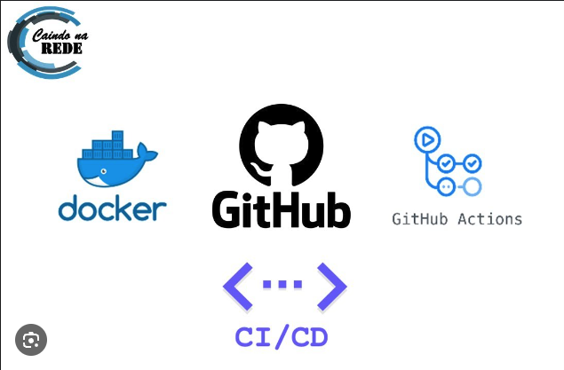

<h2 align = "center">  End-to-End Machine Learning Projects </h2> 

|  [Student Performance Indicator](https://github.com/shaikhneha2911/End-to-End-ML-Projects/tree/main/mlproject)|  [Customer Churn Prediction](https://github.com/shaikhneha2911/End-to-End-ML-Projects/tree/main/Bank-Customers-Churn-Prediction)|
| :-:| :-:| 
| | |

| [MLFlow project deployed in the AWS EC2 instance](https://github.com/shaikhneha2911/End-to-End-ML-Projects/tree/main/Machine-Learning-Project-with-MLflow)| [AWS CI/CD Project](https://github.com/shaikhneha2911/End-to-End-ML-Projects/tree/main/AWS-CI-CD-Projects)|
| :-:| :-:| 
| | 

| [Books Recommendation System Webpage](https://github.com/shaikhneha2911/Books-Recommender-System-Using-Machine-Learning)| [Multivariate Time Series Forcasting](https://github.com/shaikhneha2911/End-to-End-ML-Projects/tree/main/Multivariate%20Time%20Series%20Forcasting)|
| :-:| :-:| 
| | 

 
| [Credit Card Fraud Detection Using GraphDB (Neo4j)](https://github.com/shaikhneha2911/Credit-Card-Fraud-Detection-Using-Neo4j)|
| :-: |
| | 

 
