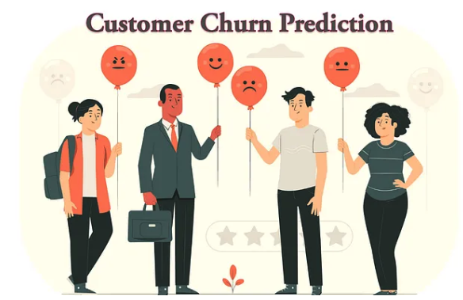

## End to End ML Projects

<h2 align = "center">  Machine Learning Projects </h2> 

|  [Student Performance Indicator](https://github.com/shaikhneha2911/End-to-End-ML-Projects/tree/main/mlproject)|  [Customer Churn Prediction](https://github.com/shaikhneha2911/End-to-End-ML-Projects/tree/main/Bank-Customers-Churn-Prediction)|
| :-:| :-:| 
| | |

| [MLFlow project deployed in the AWS EC2 instance](https://github.com/shaikhneha2911/End-to-End-ML-Projects/tree/main/Machine-Learning-Project-with-MLflow)| [Time Series Modelling using ARIMA & SARIMAX Model](https://github.com/iqrabismii/Machine-Learning-Projects/tree/main/TimeSeriesModelling)|
| :-:| :-:| 
| | 

| [Movies Recommendation System](https://github.com/iqrabismii/MoviestRecommendationSystem/tree/main/MoviesRecommendationSystem)| [Collaborative Filtering for Movies using Matrix Factorisation](https://github.com/iqrabismii/MoviesRecommendationSystem/tree/main/CFBasedRecommendation)|
| :-:| :-:| 
| | 
 

|  [House Price Prediction Model](https://github.com/iqrabismii/Machine-Learning-Projects/tree/main/housepriceprediction)| [Popular Recipe Predition Model](https://github.com/iqrabismii/Machine-Learning-Projects/tree/main/PredictingPopularRecipe)|
| :-: | :-: |
| | | 

|  [Speech Emotion Recognition](https://github.com/iqrabismii/Machine-Learning-Projects/tree/main/SpeechEmotionRecognition)|
| :-: |
| | 

 
